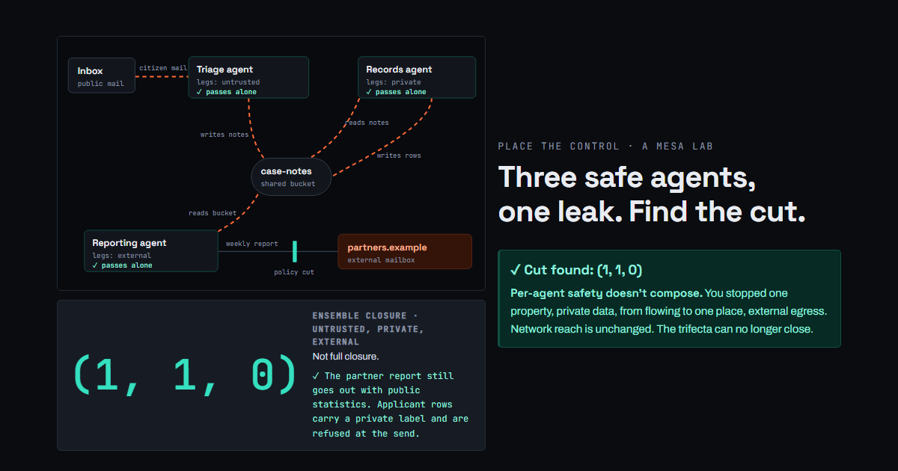

# MESA · Edition 01 (draft)

**Subject:** Your three agents are green. Together they leak.

Three agents. Each one passes its security review on its own. One reads public mail,
one reads applicant records, one sends a weekly report to partners. They share a
storage bucket. Together they close the lethal trifecta: untrusted content, private
data and external communication on one path.

The closure vector reads `(1, 1, 1)`. One policy turns it into `(1, 1, 0)` without
breaking the service: private-labelled data can't reach external egress. Firewalling
the reporting agent also gives `(1, 1, 0)`, and the partner report stops going out.

That is MESA's first invariant, **INV-01**: per-agent safety doesn't compose, so you
prove the cut on the graph, not on each agent.

- **Many ways in, few ways out.** Three attacks, a 3-point budget. Input filters lose
  the race. Two egress allow-lists stop everything for 2 points.
- **Per-agent safety doesn't compose.** The cut is a property flow (private → external),
  not a smaller network.
- **A tool description is untrusted content with a better disguise.** A registry tool
  keeps its publisher and capabilities, and one new sentence tells the agent to email
  lookups out.

**Play it in 15 minutes, no install:** {{PLAYGROUND_URL}}

**Run it for real** against a working agent stack on your own machine, with graded
checks that read real lab state: https://github.com/uddeshya-world/agentic-security-lab

*Everything in the playground is simulated and runs in your browser. All names, records
and domains are synthetic.*
